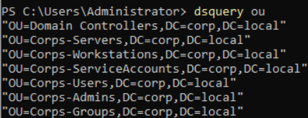

# Active Directory Deployment
A Windows Server 2022 virtual machine was configured as the domain controller for the lab environment.
Configuration included:
* Installed Active Directory Domain Services
* Promoted server to Domain Controller
* Created domain: corp.local

The domain controller also provides:
* DNS services for internal name resolution
* Authentication services for domain users and computers

# Organizational Structure
The following objects were created to simulate a small enterprise environment:
Organizational Units:

## Users:
* Administrative account: Administrator
* Standard user accounts: John Doe, Alice Smith
* Service account: svc_backup

## Groups:
IT Support security group
* Domain Admins (default)

* Workstations:
CLIENT01

This structure enables realistic authentication and privilege escalation scenarios.

# Domain Join Validation
A Windows client machine was joined to the domain to generate:
* Authentication logs
* Group membership changes
* Privilege escalation events

Successful domain join was verified through:
* Domain login testing

* DNS resolution validation

* Group Policy application

