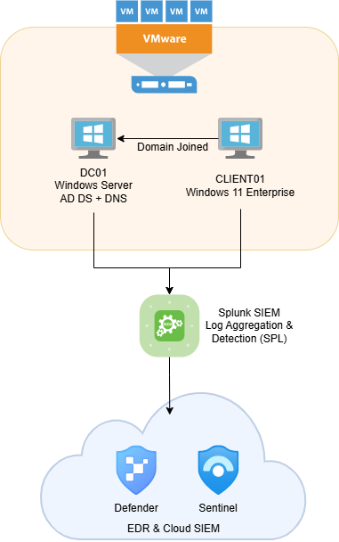

# SOC Home Lab – End-to-End Detection Environment

## Technologies:
- Active Directory
- Windows Server
- Sysmon
- Splunk Inc.
- Microsoft Corporation (Sentinel / Defender)
- VMware Workstation

## Lab Goals:
- Simulate enterprise Windows domain
- Generate attack telemetry
- Build detection queries
- Perform incident investigation

## Architecture:

## Key Skills Demonstrated:
- Log ingestion
- Detection engineering
- Incident response
